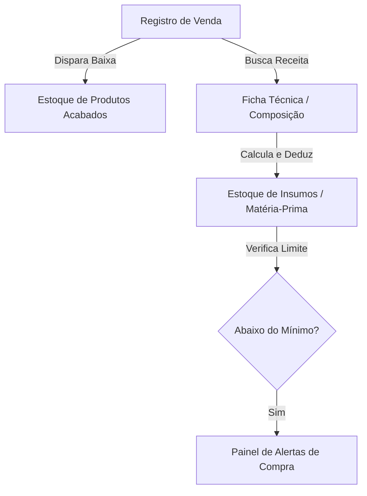
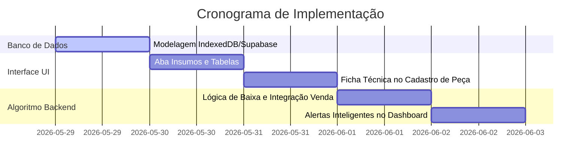

# Plano de Implementação: Gestão Inteligente de Insumos & Matéria-Prima

Este documento detalha o planejamento técnico e de interface (UX/UI) para a criação do **Módulo de Gestão de Insumos** para a marca **Deu Nó**. O objetivo principal é cadastrar as matérias-primas das peças (cordas por metro, argolas, pingentes, resinas) e automatizar a baixa de estoque de insumos com base nas vendas de produtos acabados, sinalizando de forma inteligente quais materiais estão acabando.

---

## 🗺️ Visão Geral da Arquitetura

O sistema passará a operar com uma lógica de **Ficha Técnica (BOM - Bill of Materials)**. Cada produto cadastrado no catálogo terá uma receita de composição indicando quais insumos e em quais quantidades ele é feito.

---

## 1. 🗄️ Modelagem do Banco de Dados

Para viabilizar essa funcionalidade tanto localmente (IndexedDB/LocalStorage) quanto na nuvem (Supabase), criaremos uma tabela de **Insumos** e uma tabela de relacionamento de **Composição (Ficha Técnica)**.

### A. TABELA INSUMOS (`insumos`)
Representa o inventário físico de matérias-primas e cordas.
* `id` (text/uuid, PK): Identificador único.
* `nome` (text): Nome descritivo (ex: *Corda Náutica 4mm*, *Argola de Metal*).
* `tipo` (text): Categoria do material (`corda`, `argola`, `fecho`, `resina`, `embalagem`, `outro`).
* `especificacao` (text): Cor ou variação (ex: *Verde Militar*, *Ouro*, *Tartaruga*).
* `preco_custo` (numeric): Preço pago pelo insumo (ex: *R$ 5.00* por metro de corda, *R$ 0.80* por argola).
* `unidade_medida` (text): Unidade de controle (`metro`, `unidade`, `grama`).
* `estoque_atual` (numeric): Estoque físico disponível no atelier.
* `estoque_minimo` (numeric): Limite de segurança que dispara o alerta de compras.
* `created_at` (timestamp).

### B. TABELA COMPOSIÇÃO / FICHA TÉCNICA (`produto_insumos`)
Associa um produto aos seus insumos de fabricação.
* `id` (text/uuid, PK).
* `produto_id` (text, FK): Referência ao produto.
* `insumo_id` (text, FK): Referência ao insumo consumido.
* `quantidade_necessaria` (numeric): Fração ou quantidade exata utilizada por unidade de produto (ex: *1.20* metros de corda, *2.00* unidades de argolas).

---

## 2. 🎨 Design da Interface do Admin (UX/UI)

### A. Nova Aba na Sidebar: "Insumos" (`sec-insumos`)
Adicionaremos um item no menu lateral do admin chamado **Insumos** (ícone `fa-scissors` ou `fa-dolly`), que abrirá uma seção contendo:
* **Métricas Principais (KPIs):**
  * Total de itens com estoque crítico (abaixo do mínimo).
  * Valor financeiro total investido parado em estoque de matéria-prima.
* **Tabela de Inventário de Insumos:**
  * Exibição de Nome, Tipo, Especificação/Cor, Estoque Atual (com unidade de medida, ex: *12.4 m* ou *45 un*).
  * Status visual colorido: **Verde** (Estoque Saudável), **Amarelo** (Estoque Próximo ao Limite) e **Vermelho** (Estoque Crítico / Esgotado).
* **Botão "Cadastrar Insumo":** Abre um modal rápido para preencher Nome, Tipo, Cor, Preço de Custo, Unidade de Medida, Estoque Inicial e Limite Mínimo.

### B. Integração no Cadastro de Produtos ("Ficha Técnica")
No modal de **Cadastrar Novo Produto** (que acabamos de redesenhar), adicionaremos um seletor dinâmico de composição:
* **Seletor de Insumos:** Um campo onde o usuário pode clicar em "+ Adicionar Insumo da Peça", selecionar qual insumo cadastrado aquela peça consome e digitar a quantidade necessária.
* **Custo Automático Inteligente:** O campo **Custo da Peça (Insumos)** passará a ser calculado e bloqueado para escrita, sendo a soma automática das frações da sua ficha técnica (ex: *1.2m de corda a R$ 5/m = R$ 6.00* + *2 argolas a R$ 0.80/un = R$ 1.60* $\rightarrow$ *Custo total: R$ 7.60*).

---

## 3. ⚙️ Lógica de Baixa Transacional Automática (Javascript)

Ao registrar com sucesso uma nova transação no formulário de Vendas (`handleSubmitVenda` em `app.js`), a seguinte lógica em cascata será executada:

1. **Baixa do Produto Acabado:** Reduz a quantidade do produto em estoque (ex: vendeu *2 Colares Rastro* $\rightarrow$ `-2` unidades no estoque do colar).
2. **Consulta de Receita:** O sistema consulta no banco de dados IndexedDB/LocalStorage se o produto vendido possui registros associados na tabela de composição (`produto_insumos`).
3. **Dedução de Insumos:** Para cada ingrediente da composição, calcula-se a baixa proporcional:
   $$\text{Quantidade Deduzida} = \text{Quantidade Vendida} \times \text{Quantidade Necessária na Ficha}$$
4. **Atualização no Banco:** O sistema executa o débito no estoque do insumo correspondente:
   $$\text{Novo Estoque Insumo} = \text{Estoque Atual} - \text{Quantidade Deduzida}$$
5. **Checagem de Alerta:** Caso o novo estoque fique menor ou igual ao `estoque_minimo`, um alerta em segundo plano é ativado.

---

## 4. 🧠 Lógica de Inteligência e Alertas de Ruptura

O dashboard principal ganhará um novo card de alerta de IA ou no topo das telas, trazendo insights inteligentes e avisos de ruptura de matéria-prima:

> [!WARNING]
> **Estoque Crítico de Insumos:**
> * O insumo **Corda Náutica 4mm Verde Militar** possui apenas **3.2 metros** em estoque (Mínimo: 10.0m). 
> * Com esta quantidade, você só conseguirá produzir mais **2 unidades** do produto **Colar Rastro**! Sugerimos reabastecer.

---

## 📅 Cronograma de Entrega (Passo a Passo)

---

### Opções de Implementação Futura:
*(A serem validadas com o usuário no andamento do projeto)*

* [ ] **Opção A (Simples):** Controle de insumos exclusivamente local via LocalStorage/IndexedDB, sem necessidade de alterações estruturais na nuvem do Supabase. Ideal para validação rápida.
* [ ] **Opção B (Completa):** Criação das tabelas relacionais na nuvem via DDL do Supabase com relacionamentos em chave estrangeira e atualizações transacionais seguras em nível de banco de dados.
